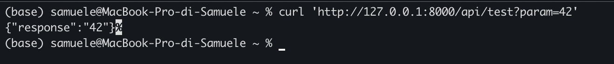

# Esercizio in Laravel

Questo progetto Laravel contiene un'API che riceve un parametro in GET e restituisce lo stesso parametro come risposta, un command che aggiorna il valore di un contatore ogni minuto e una pagina web che mostra il valore del contatore.

## Prerequisiti

- PHP 
- Composer

## Installazione

1. Clona il repository
    ```bash
    git clone https://github.com/SamueleNonino/laravel-exercise
    cd nome-del-repo
    ```

2. Installa le dipendenze
    ```bash
    composer install
    ```

3. Crea un file `.env` copiando il file di esempio e configura il database
    ```bash
    cp .env.example .env
    ```

4. Genera la chiave dell'applicazione
    ```bash
    php artisan key:generate
    ```

5. Esegui le migrazioni per creare le tabelle nel database
    ```bash
    php artisan migrate
    ```
6. Avvia il progetto
    ```bash
    php artisan serve
    ```

## Utilizzo

### API

L'API è disponibile all'endpoint `/api/test`. 


### Command

Il command andrà a aggiornare il contatore di un record sul database

Per avviare lo scheduler eseguire

```bash  
php artisan schedule:work
```

Alla pagina localhost:8000 si potra consultare il valore del contatore 
